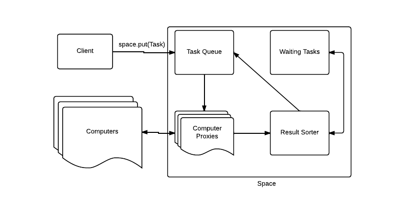

CS290B-HW4
==========

ASSIGNMENT 4

by Karl Lopker

Design Document
---------------

This system is made up of several parts; the Space, the Client and the Computer. The Space is the coordinator. The client initiates a job. The Computer(s) do the actual computation. This system is like the JICOS system except the HSP and the Task Server are all in the Space component. There is also some fault tolerance built in, but not as much as the JICOS system.

The Space, the large block in the center of the diagram, is the most complex piece. The Space is the first to start up. It waits for computers to register with it. When a computer connects the space makes a proxy for it. The Space will only talk to the proxy. Then a client will connect to the Space. When a client sends the first task the space will add it to its task queue. The computer proxies are waiting for a task and when one comes the proxy will send it off to its computer though the execute method. The Computer will run the task, package all the necessary information into a Result and return it to the space when a Result Sorter is waiting for it. The Sorter is a separate thread that can unpack Results and direct information to the correct queues.

A Result has any of three things; More tasks, a task specific result, and/or a updated shared object. The sorter will add any new tasks that are not waiting to the task queue. The tasks that are waiting are added to the waiting queue. The sorter then takes the task result and scans the waiting queue to see if any dependencies are met. If so the sorter will move a ready task to the task queue. Finally the sorter will notify the space that there's a new shared object to check. The space can reject or accept and distribute the shared object.

The shared object is distributed when the computer proxy takes a task from the task queue. Before the task is sent out the proxy will package the shared object with the task. The computer will have to check if the shared object is null or not. If the computer does not respond a failure can occur.

When a failure happens the proxy will get a Remote Exception. Since only one task is sent out at a time the proxy can store a copy of the sent task. If a computer dies the proxy simply puts the task back into the task queue and then removes itself from the set of available proxies. Then another proxy can send out the same task. Unfortunately if the Space were to fail the whole system would be compromised.
