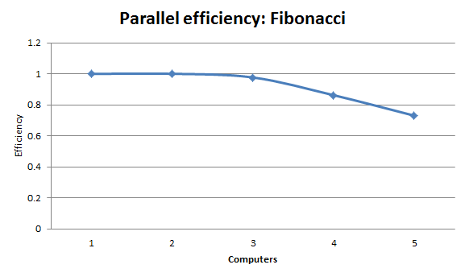

CS290B-HW3
==========

ASSIGNMENT 3: A DIVIDE-AND-CONQUER API

by Karl Lopker

Results
-------

### Fibonacci
Calculating F(16) recursively. Best of 4 runs.

#### Same JVM
	Total Time: 3.467 sec

#### Different JVMs, same machine
	Total Time: 2.252 sec

#### Different machines.
	Total Time: 2.653 sec

#### Parallel Efficiency
	1. 3096
	2. 1547
	3. 1056
	4. 897
	5. 847

### Sales Man
Calculating a 12 city tour with a task split cut off of 8 cities. Best of 4 runs.

#### Same JVM
	Total Time: 37.353 sec

#### Different JVMs, same machine
	Total Time: 34.047 sec

#### Different machines.
	Total Time: 34.125 sec

#### Parallel Efficiency, multiple computers
	1. 33997
	2. 16857
	3. 11188
	4. 8416
	5. 6862

Analysis
--------
#### What do you see as the advantages/disadvantages of your task scheduler?
The task scheduler in use is pretty inefficient. The advantage is that it's simple. Essentially, the Space has a running thread that every time a finished task comes in it loops over the waiting tasks to see if a dependency is met. If it finds a matching dependency the scheduler will check to see if that task is now ready and if so will move it to the ready task queue.

An improvement could be to use a hash table with all the dependencies in it. Each entry would link to the waiting task that needs it. This would take lookup time from O(n) to O(1). Of course this is a speed/memory trade off.

#### How might you change the infrastructure to improve your parallel efficiency?
Currently the major bottle neck is the one Space. Having many Spaces with their own computers would increase the available task bandwidth.

Also, increasing the work done per task ratio would decrease the umber of tasks and increase parallel efficiency. This can be seen by comparing the efficiencies between the Fibonacci tests (less work) and the Salesman tests (more work). The Salesman tests stay efficient with more computers.

#### What issues are involved in generalizing your infrastructure to a network of Spaces?
Coordinating the Spaces would be a difficult issue to tackle. We would need to figure out the most efficient structure for spaces that is both fast and fault tolerant. Also, weeding out any single point of failure and making sure completed tasks are not lost is important.

