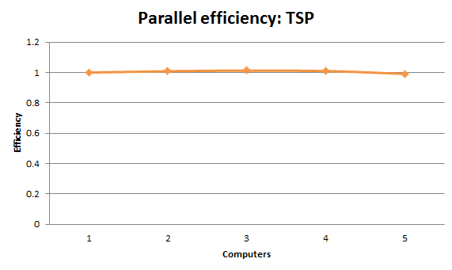

CS290B-HW5
==========

ASSIGNMENT 5

by Karl Lopker

Results
-------

### Fibonacci
Calculating F(20). Best of 4 runs.

#### Multicomputers off, local tasks off
- 1 Computer:
- 8 Computers:
- 16 Computers:

#### Multicomputers on, local tasks off
- 1 Computer:
- 8 Computers:
- 16 Computers:

#### Multicomputers off, local tasks on
- 1 Computer:
- 8 Computers:
- 16 Computers:

#### Multicomputers on, local tasks on
- 1 Computer:
- 8 Computers:
- 16 Computers:

#### Parallel Efficiency, multiple computers
1. 105705/(1*105705) = 1
2. 105705/(2*52079) = 1.014
8. 105705/(8*37178) = 0.355

### Mandelbrot Set
Calculating a Mandelbrot set with iteration limit of 4096. Best of 4 runs.

#### Multicomputers off, local tasks off
- 1 Computer:
- 8 Computers:
- 16 Computers:

#### Multicomputers on, local tasks off
- 1 Computer:
- 8 Computers:
- 16 Computers:

#### Multicomputers off, local tasks on
- 1 Computer:
- 8 Computers:
- 16 Computers:

#### Multicomputers on, local tasks on
- 1 Computer:
- 8 Computers:
- 16 Computers:

#### Parallel Efficiency, multiple computers
1. 105705/(1*105705) = 1
2. 105705/(2*52079) = 1.014
8. 105705/(8*37178) = 0.355

### Sales Man
Calculating a 13 city tour with a task split cut off of 4 cities. Best of 4 runs.

#### Multicomputers off, local tasks off
- 1 Computer:
- 8 Computers:
- 16 Computers:

#### Multicomputers on, local tasks off
- 1 Computer:
- 8 Computers:
- 16 Computers:

#### Multicomputers off, local tasks on
- 1 Computer:
- 8 Computers:
- 16 Computers:

#### Multicomputers on, local tasks on
- 1 Computer:
- 8 Computers:
- 16 Computers:

#### Parallel Efficiency, multiple computers
1. 105705/(1*105705) = 1
2. 105705/(2*52079) = 1.014
8. 105705/(8*37178) = 0.355

Analysis
--------
#### Explain your parallel [in]efficiencies
Each computer in these tests contained 4 cores. This program is designed to used all of them. So when we are testing 8 computers, that's really 32 cores at work. This is enough parallelism to strain most non-embarrassingly parallel applications. From the graph we can see that at two computers (8 cores) the parallel efficiency is holding strong. However, when 8 computers are used (32 cores) efficiency takes a hit. This is without a doubt do to the Space's inefficiencies. The space makes several expensive operations, like in its dependency sorting method, that drastically slows down task transfers. To alleviate this new data structures should be used. Also only one thread does the task sorting, this could be parallelized as well.
