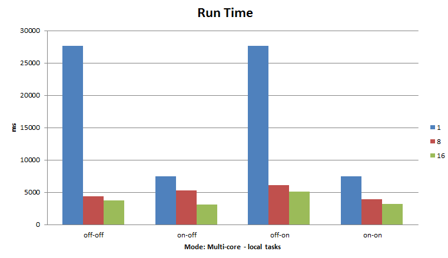
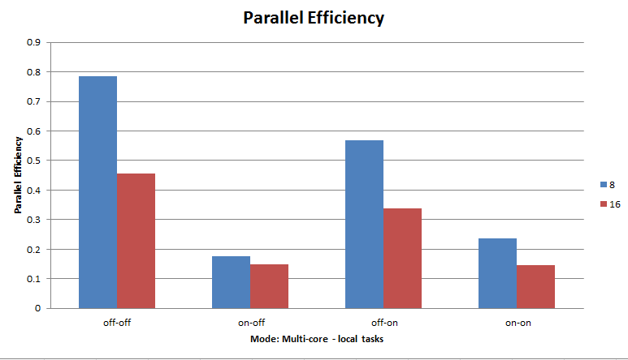
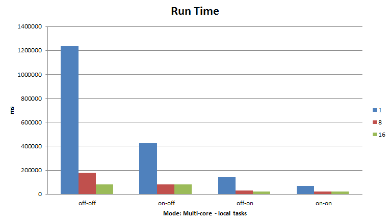
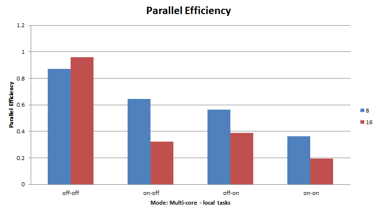

CS290B-HW5
==========

ASSIGNMENT 5

by Karl Lopker

Results
-------

### Fibonacci
Calculating F(20). Best of 4 runs.

#### Multi-core off, local tasks off
- 1 Computer: 14911
- 8 Computers: 2793
- 16 Computers: 2266

#### Multi-core on, local tasks off
- 1 Computer: 4270
- 8 Computers: 2116
- 16 Computers: 2093

#### Multi-core off, local tasks on
- 1 Computer: 4313
- 8 Computers: 581
- 16 Computers: 405

#### Multi-core on, local tasks on
- 1 Computer: 1087
- 8 Computers: 448
- 16 Computers: 379

#### Parallel Efficiency

### Mandelbrot Set
Calculating a Mandelbrot set with iteration limit of 4096. Best of 4 runs.

#### Multi-core off, local tasks off
- 1 Computer: 27639
- 8 Computers: 4401
- 16 Computers: 3785

#### Multi-core on, local tasks off
- 1 Computer: 7483
- 8 Computers: 5295
- 16 Computers: 3137

#### Multi-core off, local tasks on
- 1 Computer: 27673
- 8 Computers: 6071
- 16 Computers: 5096

#### Multi-core on, local tasks on
- 1 Computer: 7511
- 8 Computers: 3976
- 16 Computers: 3213

#### Parallel Efficiency

### Sales Man
Calculating a 16 city tour with a task split cut off of 4 cities. Best of 4 runs.

#### Multi-core off, local tasks off
- 1 Computer: 1236356
- 8 Computers: 177366
- 16 Computers: 80480

#### Multi-core on, local tasks off
- 1 Computer: 425210
- 8 Computers: 82460
- 16 Computers: 82297

#### Multi-core off, local tasks on
- 1 Computer: 147496
- 8 Computers: 32704
- 16 Computers: 23687

#### Multi-core on, local tasks on
- 1 Computer: 69084
- 8 Computers: 23884
- 16 Computers: 22145

#### Parallel Efficiency

Analysis
--------
By far the best improvment in run time was the addition of the multi-core code. This is becasue it effectivly gave a 4x increase in the number of computers avaliable for processing.
